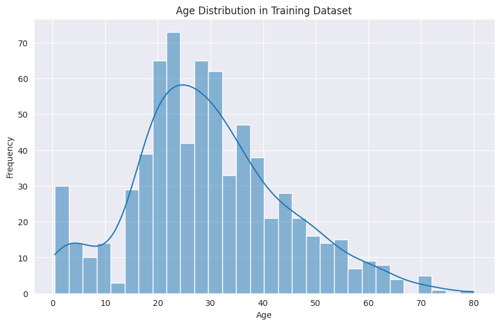
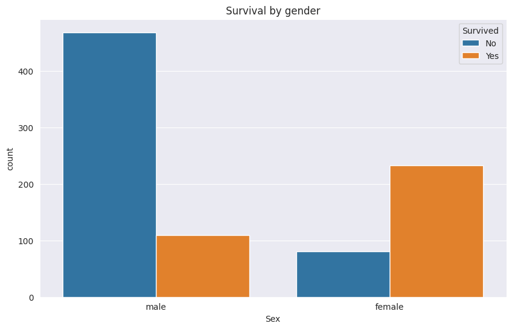
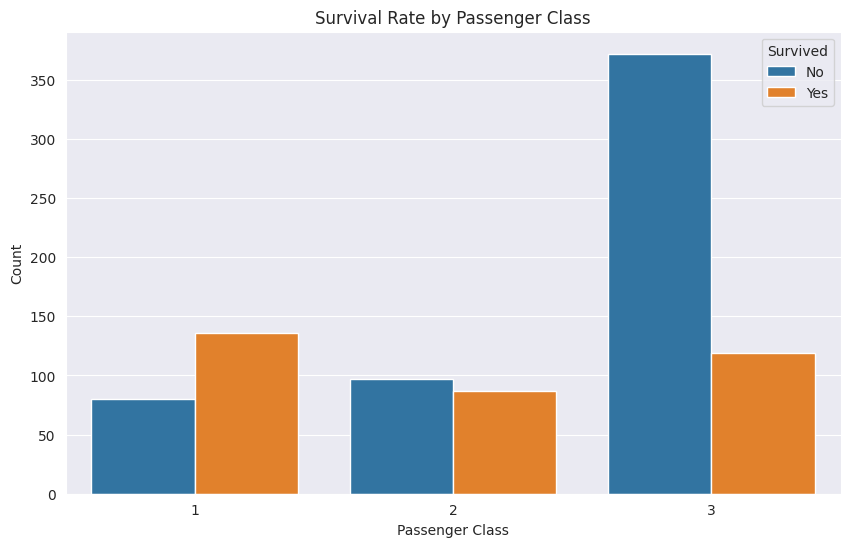

# 🚢 Titanic Survival Prediction with Scikit-learn and PyScript


This project demonstrates the complete lifecycle of a Machine Learning model: from data analysis and preparation to training a predictive model and deploying it as an interactive web application. It runs 100% in the browser with no back-end required, thanks to PyScript.

## 🚀 Live Demo

You can try the live application! This repository is enabled with GitHub Pages.

**The project is live at: [https://ygorsmc.github.io/Titanic/](https://ygorsmc.github.io/Titanic/)**

## 📊 Data Visualization

To better understand the dataset, an exploratory data analysis was performed. The visualizations below, created with Matplotlib and Seaborn, reveal key patterns in the training data.

#### Age Distribution
This histogram shows the distribution of passenger ages. The majority of passengers were young adults, between 20 and 40 years old. This information was crucial for handling missing `Age` values by imputing the median.



#### Survival by Gender
This chart clearly illustrates the "women and children first" protocol. The survival rate for females was significantly higher than for males.



#### Survival by Passenger Class
Survival was strongly correlated with passenger class. First-class passengers had a much higher chance of survival, while third-class passengers had the lowest rate.



## ✨ Features

* **Interactive Interface:** Allows anyone to input data for a fictional passenger.
* **Real-Time Prediction:** The Machine Learning model is loaded and executed directly in the browser to predict the survival outcome.
* **Zero Back-end:** All logic, including the ML model, is executed on the client-side with PyScript.
* **Responsive:** The interface adapts to different screen sizes.

## 🛠️ Tech Stack

* **Data Science & Machine Learning:**
    * `Python`
    * `Scikit-learn`: To create the preprocessing pipeline and the `RandomForestClassifier` model.
    * `Pandas`: For data manipulation and preparation.
    * `NumPy`: For numerical operations.
    * `Joblib`: To save and load the trained pipeline.
    * `Matplotlib` & `Seaborn`: For data visualization.
* **Frontend:**
    * `HTML5`
    * `CSS3`
    * `PyScript`: To run Python code and ML libraries in the browser.
* **Environment:**
    * `Jupyter Notebook`: For development and training.

## 📁 Project Structure

```
/
|-- assets/
|   |-- age_distribution.png
|   |-- survival_by_gender.png
|   |-- survival_by_class.png
|-- titanic_pipeline.joblib
|-- index.html
|-- scikitlearn_model.ipynb
|-- README.md
```

## ⚙️ Running Locally

To test the project on your local machine, follow the steps below:

1.  **Clone the repository:**
    ```bash
    git clone [https://github.com/ygorsmc/Titanic.git](https://github.com/ygorsmc/Titanic.git)
    ```
2.  **Navigate to the project folder:**
    ```bash
    cd Titanic
    ```
3.  **Start a local server:**
    Since PyScript needs to fetch files (`.joblib`), you need a local server. If you have Python installed, the command below is the simplest way:
    ```bash
    python -m http.server
    ```
4.  **Access in your browser:**
    Open your browser and go to `http://localhost:8000`.

## 🧠 The Machine Learning Model

The application's core is a classification model trained to predict the `Survived` field from Kaggle's famous Titanic dataset.

* **Model:** `RandomForestClassifier`.
* **Preprocessing:** A Scikit-learn `Pipeline` was used to automate the steps of:
    * Encoding categorical features (`Pclass`, `Sex`, `Embarked`) with `OneHotEncoder`.
    * Handling missing values (imputing with the median for `Age` and `Fare`, and the mode for `Embarked`).
* **Features Used:** The following features were used for training: `Pclass`, `Sex`, `Age`, `SibSp`, `Parch`, `Fare`, `Embarked`.
* **Performance:**
    * **Training Accuracy:** 84%
    * **Test Accuracy (against `gender_submission.csv`):** 93.78%

For a detailed analysis of the entire model creation process, please refer to the [scikitlearn_model.ipynb](./scikitlearn_model.ipynb) notebook.

## 📄 License

Distributed under the MIT License.

## 🔗 Author

* **Ygor Carvalho**
* **LinkedIn:** [linkedin.com/in/ygorsmc](https://linkedin.com/in/ygorsmc/)
* **GitHub:** [github.com/ygorsmc](https://github.com/ygorsmc)